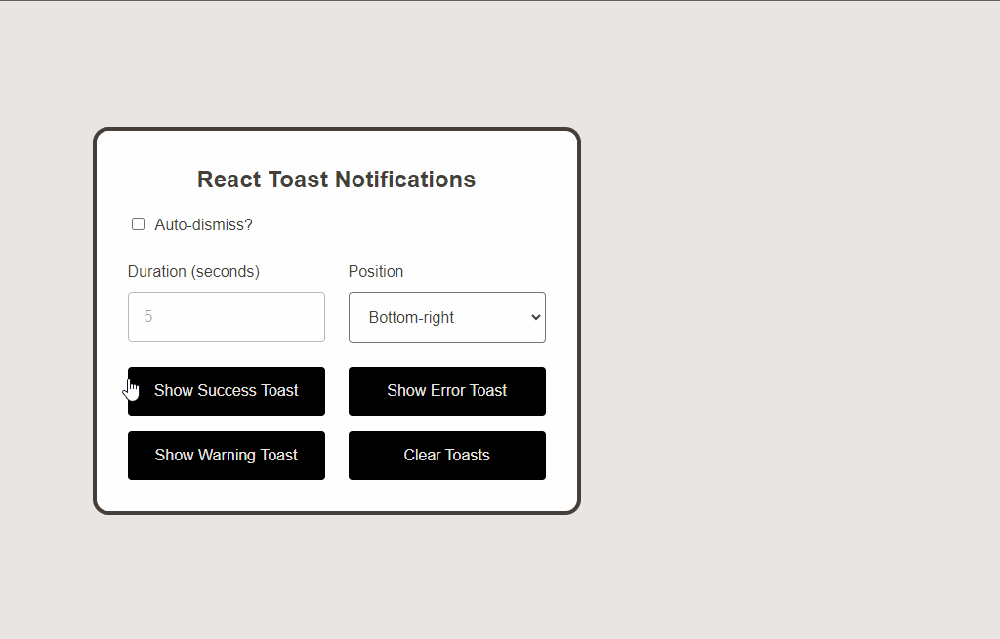

# React Toast Notifications

This demonstration showcases a straightforward implementation of toast notifications in React, without the need for any additional dependencies. The implementation primarily relies on the `useState` and `useEffect` React hooks. It also provides intuitive positioning options for notifications, including all four positions on the screen. The toast notifications are intelligently aligned based on their specified position.

## Key features

- Designed for handling multiple notifications.
- Functions effectively with various positions on the screen.
- Supports automatic deletion of toasts after a specified duration.
- Easily add your own notification types.
- Styled with pure CSS, no additional frameworks required
- Supports SVG icons; icons utilized are from [FontAwesome](https://fontawesome.com/search?o=r&m=free)
- No extra React dependencies are necessary whatsoever

To get started, clone the repository, navigate to the cloned directory, and execute `npm i` to install the essential React dependencies. Use `npm run dev` to run the application.

Alternatively, you can explore this [StackBlitz demo](https://stackblitz.com/edit/vitejs-vite-qhqmg5?file=src%2FApp.jsx) to see the implementation in action without the need for a local installation.
